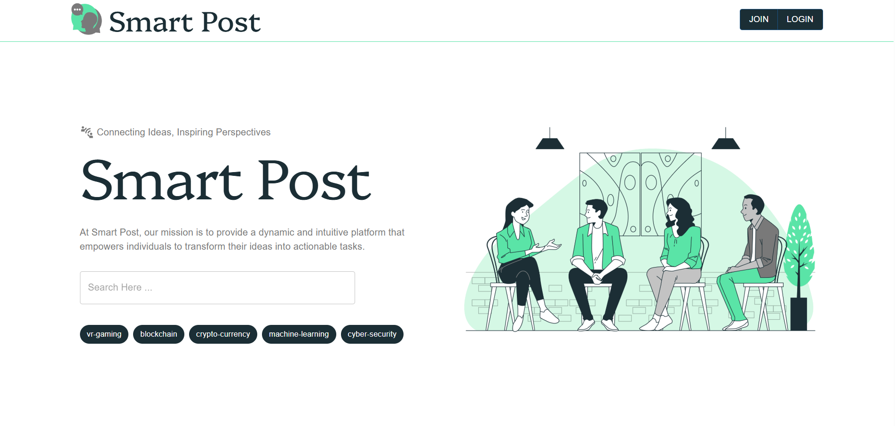

# Smart Post

Smart Post is a full-stack content platform for managing posts, products, and tasks — built with
a React (Vite + MUI) frontend and an Express + MongoDB backend.



## Project Structure

```
SmartPost/
├── client/                    # React frontend (Vite)
│   ├── public/                 # Static assets (favicon, images, icons)
│   ├── index.html
│   ├── .env.example             # Copy to .env and fill in real values
│   └── src/
│       ├── components/          # Reusable UI building blocks, grouped by feature
│       │   ├── common/            # Shared widgets (AlertBox, ConfirmDialog)
│       │   ├── post/               # Post-specific components (PostPreviewModal)
│       │   ├── profile/            # Profile/product/task-management widgets
│       │   ├── dashboard/          # Admin dashboard widgets
│       │   ├── setting/            # Account settings widgets
│       │   └── home/               # Public marketing page sections
│       ├── hooks/                # Custom hooks (useThinkify — the app's shared UI-state hook)
│       ├── layouts/              # Page shells (NavBar, Sidebars, Footer, PublicLayout)
│       ├── pages/                 # Route-level pages
│       │   └── dashboard/           # Admin-only pages
│       ├── provider/              # React context provider (alerts, loading state)
│       └── routes/                # React Router route table
│
├── server/                    # Express backend
│   ├── .env.example             # Copy to .env and fill in real values
│   ├── index.js                  # App entry point
│   ├── config/                    # Database connection setup
│   ├── constants/                 # HTTP status codes, shared message strings
│   ├── controllers/               # Request handlers / business logic, one file per entity
│   ├── middleware/                 # Auth, file upload
│   ├── models/                     # Mongoose schemas
│   ├── routes/                     # Express route definitions, one file per entity
│   └── uploads/                    # User-uploaded files (product images), served statically
│
├── LICENSE
├── CONTRIBUTING.md
├── CHANGELOG.md               # What changed in this pass, and why
└── VERIFICATION_REPORT.md     # What was verified, what wasn't, and honestly why
```

## Requirements

- [Node.js](https://nodejs.org/) v18 or later
- A MongoDB database (local `mongod`, or a free [MongoDB Atlas](https://www.mongodb.com/atlas) cluster)
- (Optional) An [Auth0](https://auth0.com/) tenant, only if you want the Auth0 sign-in flow

## Installation

```bash
git clone <your-repo-url>
cd SmartPost
```

### 1. Backend setup

```bash
cd server
npm install
cp .env.example .env
# now edit server/.env and fill in your real DATABASE_URL, JWT_SECRET_KEY, etc.
```

### 2. Frontend setup

```bash
cd ../client
npm install
cp .env.example .env
# now edit client/.env — at minimum set VITE_SERVER_ENDPOINT to point at your backend
```

## Environment Variables

### `server/.env`

| Variable | Description |
|---|---|
| `PORT` | Port the API listens on (default `5000`) |
| `DATABASE_URL` | MongoDB connection string |
| `DATABASE_NAME` | Database name |
| `BCRYPT_GEN_SALT_NUMBER` | bcrypt salt rounds |
| `JWT_SECRET_KEY` | Secret used to sign auth tokens — use a long random value |
| `COOKIE_EXPIRES` | Cookie lifetime (e.g. `5d`) |
| `COOKIE_KEY` | Cookie name |
| `UPLOAD_DIRECTORY` | Folder (relative to `server/`) where uploads are stored |
| `AUTH0_DOMAIN` | Your Auth0 tenant domain (only needed for the Auth0 flow) |
| `EMAIL_HOST` / `EMAIL_PORT` / `EMAIL_USER` / `EMAIL_PASS` / `EMAIL_FROM` | Optional SMTP credentials for sending password-reset emails. If left unset, "Forgot Password" still works, but the reset link is printed to the server console instead of emailed — fine for local dev, not for real users. |
| `CLIENT_ORIGIN` | Base URL of your deployed frontend, used to build the password-reset link (default `http://localhost:5173`) |

### `client/.env`

| Variable | Description |
|---|---|
| `VITE_SERVER_ENDPOINT` | Base URL of the backend API, e.g. `http://localhost:5000/api` |
| `VITE_TOKEN_KEY` | Cookie key used to store the auth token |
| `VITE_USER_ROLE` | Cookie key used to store the user's role |
| `VITE_COOKIE_EXPIRES` | Cookie lifetime, in days |
| `VITE_AUTH0_DOMAIN` | Auth0 tenant domain (public, safe to expose) |
| `VITE_AUTH0_CLIENT_ID` | Auth0 SPA client ID (public, safe to expose) |

> **Security note:** anything prefixed `VITE_` is bundled into the JavaScript shipped to every
> browser. Never put a client *secret*, API key, or password behind a `VITE_` variable — a prior
> version of this project's `.env` did exactly that (an Auth0 Client Secret) and it has been
> removed. See `CHANGELOG.md` for details, and rotate/regenerate that secret and your database
> password if you were using the credentials that previously shipped with this project.

## Database Setup

No manual migration step is required — Mongoose creates collections automatically on first
write, based on the schemas in `server/models/`. Just make sure `DATABASE_URL` in `server/.env`
points at a reachable MongoDB instance before starting the server.

## Running the App

```bash
# Terminal 1 — backend
cd server
npm run dev        # starts on http://localhost:5000 (nodemon, auto-restarts on changes)

# Terminal 2 — frontend
cd client
npm run dev         # starts on http://localhost:5173 (Vite dev server)
```

Open `http://localhost:5173` in your browser.

## Running Tests

The project does not currently ship an automated test suite (see `VERIFICATION_REPORT.md` for
why this pass didn't add one, and what was done instead). `server/package.json` has a placeholder
`npm test` script; wiring up a real one (e.g. Jest + Supertest for the API, Vitest + React
Testing Library for the client) is a good next step if this project keeps growing.

## Production Build

```bash
cd client
npm run build        # outputs static files to client/dist/
npm run preview       # locally preview the production build
```

Deploy `client/dist/` to any static host (Vercel, Netlify, etc.), and deploy `server/` to any
Node host (Render, Railway, Vercel, a VPS, etc.) with the same environment variables set there.

## Troubleshooting

**"Cannot connect to database" on server start**
Check `DATABASE_URL` in `server/.env` — if you're using MongoDB Atlas, make sure your current IP
is allow-listed under Network Access in the Atlas dashboard.

**Login works but every other request returns 401/403**
Your `JWT_SECRET_KEY` in `server/.env` most likely doesn't match the one used to issue the
token you're holding (e.g. you changed it after logging in). Log out and back in.

**Product image upload fails**
Only JPEG, PNG, and WEBP files up to 5MB are accepted. If you get a raw 500 error rather than a
clear validation message, check the server console — the upload directory is now created
automatically on first use, so this should no longer happen, but a full disk or a permissions
issue on `server/uploads/` would still surface here.

**"Forgot Password" email never arrives**
By default no SMTP provider is configured, so nothing is actually emailed — instead, check the
**server's console output**, where the reset link is printed in full. To send real emails, fill
in `EMAIL_HOST` / `EMAIL_PORT` / `EMAIL_USER` / `EMAIL_PASS` in `server/.env` with real SMTP
credentials (e.g. from Gmail's app passwords, SendGrid, Mailgun, etc.).

**Blank page / console errors mentioning `import.meta.env`**
Make sure you copied `.env.example` to `.env` in *both* `client/` and `server/` — Vite only
reads variables from an actual `.env` file, not `.env.example`.

## License

See `LICENSE`.
